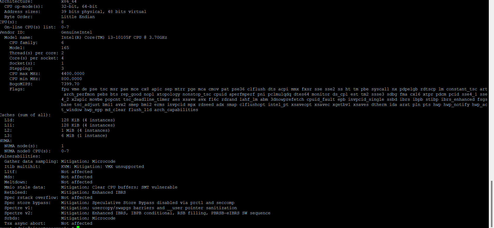
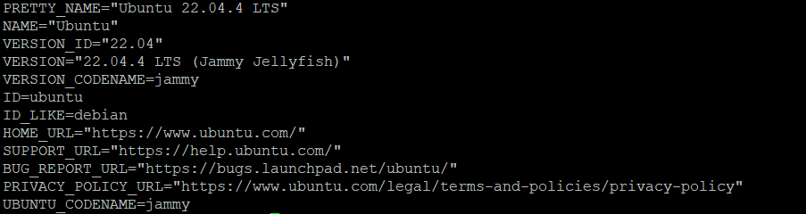

# fix_loi_nvidia_driver_tren_ubuntu_22.04

## Chào mọi người .

## Em hiện đang gặp 1 số vấn đề  về cái gpu nvidia trx 4060 ti 16gb 

## Mô tả: 
- Em trước có nhờ mọi người hỗ trợ tìm kiếm con gpu phù hợp để em build ra pc làm server để triển khai 1 số con AI yếu ( loại computer vision ) và sau 1 khoảng thời gian nghiên cứu thì em đã chọn con rtx 4060 ti 16gb .
- Sau đó em có mua về và lắp vào con pc với thông số như sau :
    - **cpu**

    

    - **ubuntu-server**

    

- Tất nhiên là em có lắp gpu vào máy pc rồi và xác nhận là nó đã nhận . em dùng lệnh:
```cmd
lspci | grep -i nvidia
```
thì nó trả về chỗ kết quả sau:
```cmd
01:00.0 VGA compatible controller: NVIDIA Corporation AD106 [GeForce RTX 4060 Ti 16GB] (rev a1)
01:00.1 Audio device: NVIDIA Corporation Device 22bd (rev a1)
```

- Vậy là rõ ràng là máy đã nhận gpu , tiếp đó em cài tiếp cái nvidia driver .
    - Đây là kết quả khi chạy lệnh này:
    ```cmd
    nvidia-settings --help
    ```
    ```cmd
    nvidia-settings:  version 510.47.03
  The NVIDIA Settings tool.

  This program is used to configure the NVIDIA Linux graphics driver.
  For more detail, please see the nvidia-settings(1) man page.


    nvidia-settings [options]

    ```
    - Ngoài ra em còn check trên hệ thống nữa dùng lệnh này thì nó ra như sau:
    ```cmd
    cat /proc/driver/nvidia/version
    ```
    ```cmd
    NVRM version: NVIDIA UNIX Open Kernel Module for x86_64  535.161.07  Release Build  (dvs-builder@U16-I1-N08-15-4)  Sat Feb 17 23:21:39 UTC 2024
    GCC version:  gcc version 11.4.0 (Ubuntu 11.4.0-1ubuntu1~22.04)
    ```

- Nhưng vấn đề em gặp phải là khi cài được cái drive rồi và đang định dùng card gpu thì em có check qua lệnh.
```cmd
nvidia-smi
```
Thì nó lại báo là không tìm thấy thiết bị.
```cmd
No devices were found
```
## Yêu cầu
- Hiện em cũng không mạnh về mảng linux lắm (hiện tại em mới bắt đầu tìm hiểu lại , do trước kia học trên trường cũng chỉ học qua mấy lệnh cơ bản thôi chứ không đào sâu để build 1 hệ thống như vậy ) . Nhưng hiện tại do sếp cũng dục em hơi gấp rồi nên em muốn fix nhanh chóng lỗi này rồi còn base linux thì có thể bổ sung sau cũng được ( do em ngồi fix cái lỗi này cũng gần 1 tuần rồi mà chả tiến triển gì )
- Thú thật thì trước em cũng hơi chủ quan không học kỹ trước linux mà search cách cài nvidia driver cho linux server và làm theo họ . ( cả các trang chính thống và một số diễn đàn ). Nên giờ nó không chạy và em cũng không rõ nó lỗi nằm ở chỗ nào .
- Em mong muốn được các anh chị có từng gặp lỗi này thì gợi ý cho em một số key hoặc chỉ cho em một số hướng đề tìm hiểu cũng được .

## Dự đoán 
- Em sau khi tìm hiểu cái này thì cũng rõ hơn 1 chút về hệ thống linux nên em nghĩ rất có thể là lúc em cài linux lên máy thì có thao tác sai chỗ nào đó khiến nó ko nhận , hoặc là khi cài nvidia drive thì có cài sai cái gì đó khiến nó không nhận .
- Trước khi chuyển sang linux server thì em có cài nvidia drive trên window 10 của máy này và thấy cài được nên có lẽ sẽ không phải lỗi do phần cứng và em vẫn có thể dùng linux để cài cắp các thư viện python và chạy docker trên này nên có lẽ linux cũng chạy ổn .

## Thông tin liên hệ .
- Nếu mọi người vào page này thông qua facebook thì có thể command trong chính bài viết đó ạ .
- Hoặc có thể mở 1 issu trên git này
- Còn nếu mọi người ẩn danh thì có thể liên hệ em qua email sau :
```cmd
quyet12306@gmail.com
```

## Em xin cảm ơn mọi người đã đọc .